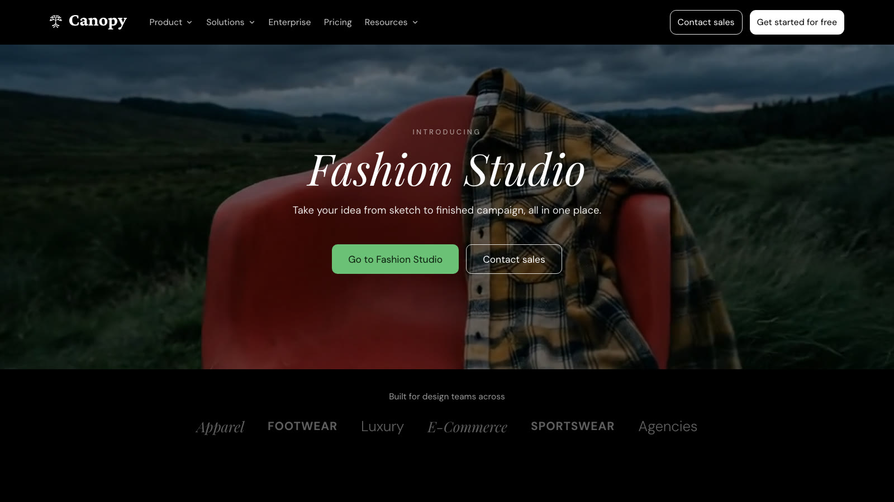
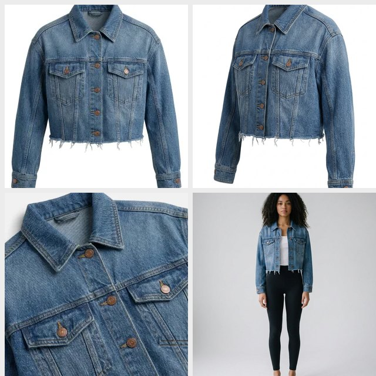

# Canopy Fashion Studio

**A visual workspace for fashion teams to develop, refine, and review product imagery.** Move from a sketch or reference to concept renders, colorways, on-model imagery, product-page assets, and team feedback in one project-based studio.

<p align="center">
  
</p>

<p align="center"><em>The landing page captured from the running application.</em></p>

<p align="center">
  
</p>

<p align="center"><em>Campaign footage used by the landing page. <a href="apps/web/public/landing/hero.mp4">Open the source MP4</a>.</em></p>

## What you can do

- **Create:** generate concepts, turn sketches into garment renders, and explore moodboards.
- **Refine:** recolor garments, swap fabric or trims, remove backgrounds, and edit selected regions.
- **Present:** create on-model try-ons, photo shoots, product-detail-page imagery, and 360° views.
- **Review together:** organize runs in projects and the Feed, share work, collect comments, and assemble review boards.
- **Keep production assets intact:** uploads and generated masters are retained byte-for-byte; editor operations create new versions instead of silently replacing originals.

The studio includes focused tools such as Sketch to Render, Recolor, Fabric Swap, Model Try-On, Photo Shoot, Garment 360, Vector, Moodboard, and PDP Shots. Availability depends on configured providers and workspace access.

## Quick start

Requirements: Node.js 20 or newer, npm, and PostgreSQL for a full local setup. Provider credentials are needed for live image or video generation.

```bash
git clone https://github.com/PrateekDevashetti/canopy-fashion-studio.git
cd canopy-fashion-studio
npm install
# Configure the local environment (see Environment below).
npm run db:push
npm run dev
```

The web app runs at [http://localhost:3200](http://localhost:3200). For background processing, start a second terminal with `npm run dev:worker`. The web app supports inline processing for local development; production uses a separate worker.

## Screenshots and media

The landing page is captured above. The repository also contains representative tool-preview imagery in [`apps/web/public/studio/previews/`](apps/web/public/studio/previews/) and guided-tour media in [`apps/web/public/studio/tour/`](apps/web/public/studio/tour/). These are product and demo assets, not customer work.

| Studio capability | Preview |
| --- | --- |
| Sketch workflow |  |
| Fabric exploration |  |
| On-model imagery |  |
| Product page imagery |  |

## How it fits together

```text
apps/web       Next.js App Router UI and API (Vercel)
apps/worker    queued generation worker (Railway)
packages/core  database, access control, credits, storage, editor and generation engine
```

Runs are created and authorized through the shared core service, then processed inline in local development or claimed atomically by the production worker. PostgreSQL stores project and run metadata; object storage holds source files and results. Clerk handles sign-in. The API health endpoint is `/api/health`.

See [`docs/PRD.md`](docs/PRD.md) for product behavior, [`docs/TASKS.md`](docs/TASKS.md) for tracked work, and [`docs/SLO.md`](docs/SLO.md) for operational expectations.

## Environment

Create the local environment file from the example if present, then configure the values required by your setup. Never commit secrets.

```dotenv
DATABASE_URL=postgres://localhost:5432/fashion_studio
```

Generation also needs the provider credentials used by the engine; object-storage and Clerk settings are needed to exercise their corresponding production integrations. The web app reads the root `.env.local` through `apps/web/.env.local` in the standard local setup. Use server-side environment variables only for secrets; do not expose provider keys through `NEXT_PUBLIC_*` variables.

## Commands

| Command | Purpose |
| --- | --- |
| `npm run dev` | Start the web application |
| `npm run dev:worker` | Start the local worker |
| `npm run build` | Build the web application |
| `npm run start` | Start the worker in production mode |
| `npm run typecheck` | Type-check all configured workspaces |
| `npm test` | Run core unit tests |
| `npm run verify` | Run type-checking and core unit tests |
| `npm run db:push` | Apply the current Drizzle schema to the configured database |

## Deployments

The web application is deployed on Vercel from `apps/web`; the generation worker runs on Railway. Production also depends on Neon PostgreSQL, R2-compatible object storage, Clerk, and configured generation providers. A Git push is not proof that a production deployment completed: check the platform deployment and `/api/health` after a release. Database changes should be reviewed and applied using the repository migration workflow in [`packages/core/migrations/`](packages/core/migrations/).

## Development notes

- Keep `packages/core/src/tools/registry.ts` as the shared source of truth for tool metadata.
- Preserve uploaded and generated masters exactly; display previews and downloads intentionally use different URLs.
- Large uploads use chunked transfer to respect the Vercel request-size limit.
- Add schema changes as idempotent numbered SQL migrations as well as updating the Drizzle schema.
- Never check in credentials, customer images, or local test artifacts.

## Contributing

Make focused changes, run `npm run verify`, and include a clear description of what changed and what you verified. For UI changes, attach a fresh screenshot or short recording when practical. Keep changes to production infrastructure and database migrations explicit and reviewable.

## License

No open-source license is currently declared. Contact Canopy Labs before reusing this project.
